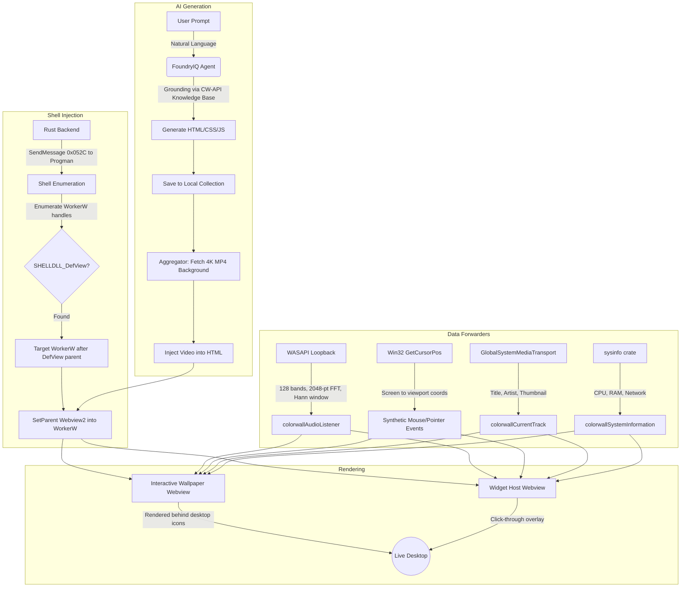

<div align="center">
  
  <p>A native desktop customization engine for Windows 10/11, built in Rust/Tauri.</p>
  <p><i>Submitted to Agents League @ AISF 2026 — Creative Apps track, integrated with Foundry IQ</i></p>
</div>

---

> I wrote this whole thing by hand. Apologies in advance for any mistakes.

## What is ColorWall?

ColorWall is a desktop customization suite that combines native Windows API integration with AI generation to produce interactive wallpapers and desktop widgets on demand. It's not a theme pack or a skin — it renders live HTML/CSS/JS content directly underneath your desktop icons using WorkerW injection, with no overlay window and no interference with your actual desktop.

The AI side is driven by **FoundryIQ**, which takes a plain-text prompt, generates a fully functional interactive wallpaper, and grounds it against ColorWall's documented JavaScript API so the output works correctly every time.

## FoundryIQ Integration

ColorWall exposes a documented JS API purpose-built for AI-generated content (CW-API). The generation flow works like this:

1. User writes a prompt.
2. FoundryIQ generates the HTML/JS, strictly grounded against the CW-API knowledge base — both as the primary instruction and as a fallback, so it essentially never hallucinates an invalid API call.
3. The output gets saved to your local interactive collection.
4. On activation, the Rust backend performs shell enumeration to locate (or create) the correct `WorkerW` handle, then attaches a Tauri Webview2 window into it. Your icons sit on top. Nothing breaks.

The choice of Webview2 over DirectX11 for interactives was deliberate — HTML/CSS/JS is a domain LLMs understand deeply, which means far less hallucination compared to asking them to write raw HLSL shaders. The tradeoff in raw performance is worth the accuracy gain.

### Shell Enumeration

Here's what it actually looks like when the engine enumerates the shell hierarchy on a real machine:

```text
[diag] windows build number: 19045
[diag] is_windows_11_or_later: false
[diag] progman handle: HWND(0x10188)
[diag] explorer patcher detected: false
[diag] progman rect: left=0, top=0, right=1920, bottom=1080 (1920x1080)
[diag] SHELLDLL_DefView directly under Progman: NO (The handle is invalid. (0x80070006))
[diag] WorkerW directly under Progman: NO (The handle is invalid. (0x80070006))
[diag]   WorkerW #1: HWND(0x904fa) rect=(0,0,136,39) 136x39 visible=false
[diag]   WorkerW HWND(0x1049a) contains SHELLDLL_DefView!
[diag]   WorkerW after defview parent: HWND(0x1049c)
[diag]   WorkerW #14: HWND(0x1049a) rect=(0,0,1920,1080) 1920x1080 visible=true
[diag]   WorkerW #15: HWND(0x1049c) rect=(0,0,1920,1080) 1920x1080 visible=true
[diag] total WorkerW windows found: 15
[diag] SHELLDLL_DefView parent: Some(HWND(0x1049a))
[diag] target WorkerW (after defview parent): Some(HWND(0x1049c))
[diag] monitor #1: "\\.\DISPLAY1" rect=(0,0,1920,1080) 1920x1080 primary=true
[diag] total monitors: 1
[diag] virtual screen: origin=(0,0) size=1920x1080
```



## Other Features

**Taskbar styling** — Acrylic, blur, and transparent taskbar effects. Works on both Win10 and Win11. The Start Menu is not hooked because Microsoft doesn't expose those APIs.

**Local library & offline support** — Works fully offline. All wallpaper types (static, video, interactive, widget) can be downloaded from the built-in store and run locally.

**Dual video renderer** — WMF (Windows Media Foundation) for native decoding, and MPV with extreme performance presets going up to spline36/EWA Lanczos for lossless playback.

**Real-time audio API** — 128 frequency bands via WASAPI loopback + 2048-point FFT with Hann windowing, exposed to wallpaper JS. Includes bass-energy-driven smoothing so visualizers look alive even during quiet passages.

**Mouse forwarding** — Polls `GetCursorPos` and `GetAsyncKeyState`, converts screen coords to viewport-local using each window's position and scale factor, then dispatches synthetic `MouseEvent` + `PointerEvent` to all active webviews including canvases.

**Media integration** — Uses Windows `GlobalSystemMediaTransportControlsSessionManager` to read the currently playing track (title, artist, album art) and forward it to wallpapers/widgets via `colorwallCurrentTrack()`.

**System telemetry** — CPU usage, available RAM, and network throughput polled via `sysinfo` and forwarded to webviews via `colorwallSystemInformation()` every 3 seconds.

**Content aggregator** — Built-in store with a large catalog of 4K wallpapers. FoundryIQ also pulls a random 4K video from the aggregator as the base background for generated interactives.

**Discord RPC** — Shows your current wallpaper to friends. Carried over from a previous project, took basically no time to add.

**Watchdog** — Background thread that monitors webview health, detects stalled or crashed renders, and handles cleanup so nothing lingers after a wallpaper swap.

## Built with AI

GitHub Copilot and FoundryIQ were used throughout development — debugging Win32 handle issues, reading crash dumps, working through shell hierarchy problems. ColorWall is an app built with AI assistance that lets users create with AI. That's the whole pitch.