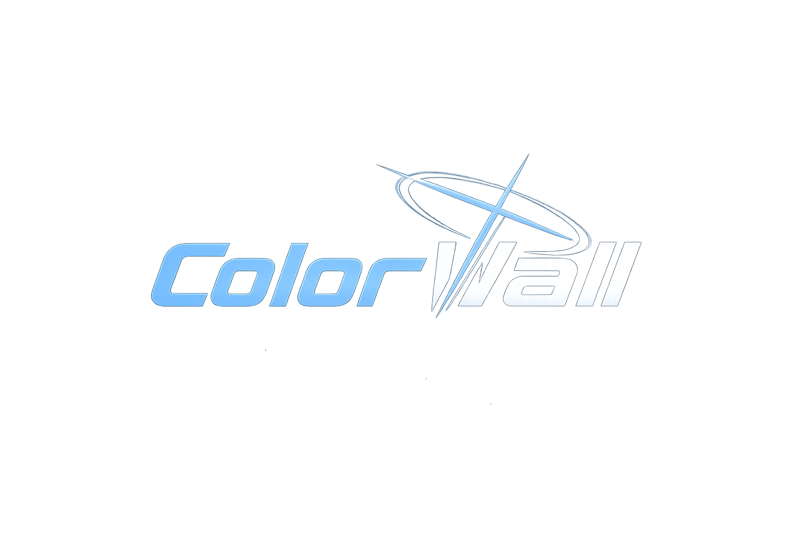
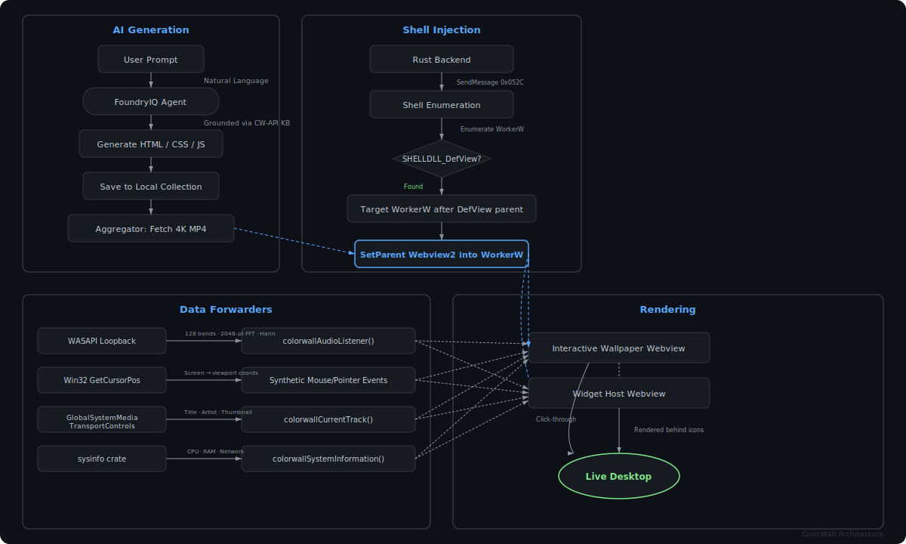
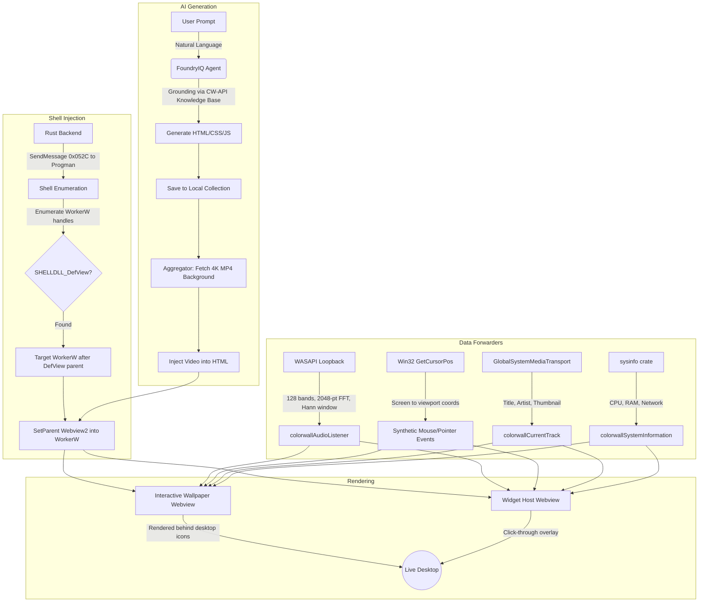

<div align="center">
  
  <br/><br/>
  <p>A blazing-fast desktop customization engine built in Rust/Tauri for Windows 10/11, For Performance and Visuals!</p>
  <p><i>Submitted to Agents League @ AISF 2026, Creative Apps track, integrated with Foundry IQ</i></p>
</div>

---

**_i have written this whole description with my hands, i am sorry in advanced if i made mistakes or it is not perfect enough, i tried my best!_**

---

## What is ColorWall?

ColorWall is not just another wallpaper app. It is a **fully native**, hyper-optimized desktop customization suite that uses the absolute limits of the Windows API alongside cutting-edge **Agentic AI** to dynamically generate interactive wallpapers and functional desktop widgets _on the fly_.

It renders **live HTML/CSS/JS** content directly _underneath_ your desktop icons using **WorkerW injection** — no overlay window, no interference with your actual desktop, your icons sit right on top like nothing changed. Except now your entire desktop is alive.

---

## FoundryIQ Integration

**FoundryIQ Integration:** ColorWall exposes a documented JavaScript API specifically designed for AI-generated content.

- Users describe a wallpaper or widget in natural language, and FoundryIQ agent generates checks the Knowledge Base, Which is ALSO passed in the instructions as a **fallback**, so it never goes wrong,
- Then The App handles the resulting Output, Saves it in the same interactive page with other ones, and On demand _Sets_ the Interactive HTML/CSS/JS wallpaper using **Shell Enumeration** To find the correct workerw handle (or create it) in the hierarchy, setting the audio-reactive, mouse-interactive, and rendered via webview2.

I used **Tauri Webview2** instead of DirectX11 for _interactives/widgets_, giving the generated content an even broader scope for effects + provides ease of creation with AI; reducing inaccuracy and hallucinations because webview2 is a well known concept, that is considering for the ease of usage, cz **HTML/CSS** is what most people can do simply using AI. than sit and play with sliders for a simple interactive wallpaper...

---

## Shell Enumeration

_Explaining everything i know and did will take too long and no one will really read it, i will just show:-_

Here is how it achieves it natively on a real machine:

```***[diag] windows build number: 19045
[diag] is_windows_11_or_later: false
[diag] progman handle: HWND(0x10188)
[diag] explorer patcher detected: false
[diag] progman rect: left=0, top=0, right=1920, bottom=1080 (1920x1080)
[diag] SHELLDLL_DefView directly under Progman: NO (The handle is invalid. (0x80070006))
[diag] WorkerW directly under Progman: NO (The handle is invalid. (0x80070006))
[diag]   WorkerW #1: HWND(0x904fa) rect=(0,0,136,39) 136x39 visible=false
[diag]   WorkerW HWND(0x1049a) contains SHELLDLL_DefView!
[diag]   WorkerW after defview parent: HWND(0x1049c)
[diag]   WorkerW #14: HWND(0x1049a) rect=(0,0,1920,1080) 1920x1080 visible=true
[diag]   WorkerW #15: HWND(0x1049c) rect=(0,0,1920,1080) 1920x1080 visible=true
[diag] total WorkerW windows found: 15
[diag] SHELLDLL_DefView parent: Some(HWND(0x1049a))
[diag] target WorkerW (after defview parent): Some(HWND(0x1049c))
[diag] monitor #1: "\\.\DISPLAY1" rect=(0,0,1920,1080) 1920x1080 primary=true
[diag] total monitors: 1
[diag] virtual screen: origin=(0,0) size=1920x1080***
```

---

## Architecture

<div align="center">
  
</div>

<details>
<summary><h1 align="center">Mermaid Diagram (click to expand)</h1></summary>



</details>

---

## More Features

Since i knew about these things and thought it will be great to add, i went ahead and->

- **Taskbar modification** with acrylic, blur, transparent type stylings, well it only works for taskbar, Does not work with Windows 11 start menu, or Windows 10 Start Menu because windows runs them differently and there is no api to start menu i know about!

- **Local Wallpaper/Video/Interactives/Widget Support** so. + Can download from the store to the Library!! **Offline Usage** is Great!

- Two different **renderer plugins**, For windows media foundation (the wallpaper-player.exe is a Plugin, and launches specifically with WMF/MPV engine, and runs for Video type wallpapers) and **Mpv** with performance presets, going upto as high as _spline36_ and _ewa lanczos_ for lossless performance.

- **Discord RPC**, because i had previously made it for a prototype i am making for linux app and it was easy to implement with ai here

- **Pretty Good one out of Extras:** Content Store! best part, i have already made A lot of aggregators in past! So i went ahead and added one here for _Fair_ use, so when FoundryIQ is done generating the Interactive from the API correctly, as it is instructed it will make place for a bg video, and the code will go ahead, get a random 4k video and implement it in it, Boom, making it look **EVEN** better!

---

## Data Forwarders

The engine runs **four background forwarder threads** that continuously push real-time data into every active wallpaper and widget webview:

| Forwarder | Source | JS Callback | Rate |
|---|---|---|---|
| **Audio** | WASAPI loopback, 128 bands, 2048-pt FFT + Hann window | `colorwallAudioListener()` | ~30fps |
| **Mouse** | `GetCursorPos` + `GetAsyncKeyState`, screen→viewport conversion | Synthetic `MouseEvent` / `PointerEvent` | ~15fps |
| **Media** | `GlobalSystemMediaTransportControlsSessionManager` | `colorwallCurrentTrack()` | 1s poll |
| **System** | `sysinfo` crate (CPU, RAM, Network) | `colorwallSystemInformation()` | 3s poll |

The API also includes zero-JS data binding via `data-cw-*` attributes — `data-cw-time`, `data-cw-media`, `data-cw-system`, etc. so widgets can display live data without writing a single line of JavaScript.

**Watchdog** runs in the background monitoring webview health, detects stalled or crashed renders, and handles cleanup so nothing lingers after a wallpaper swap.

---

## Built with AI

Usage of **Copilot** and **Foundry IQ** (in interactives and widgets tab), happened throughout development, for specific researches and fixes, finding log dumps, crashes etc and discussing issues! debugging Win32 handle issues, reading crash dumps, working through front end and fixing invokes, fixing little issues, little borrow checks, race conditions that human eyes can not catch etc.